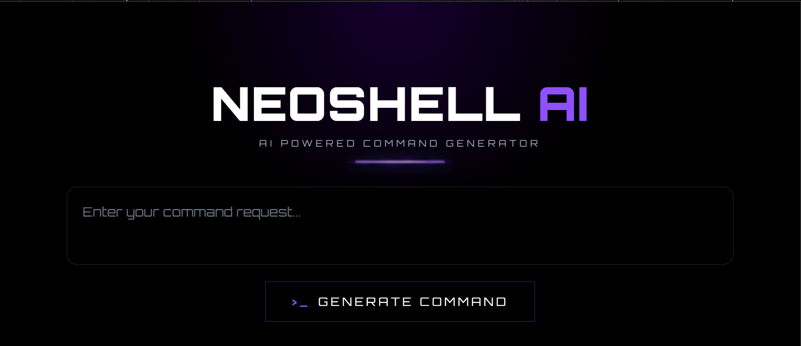
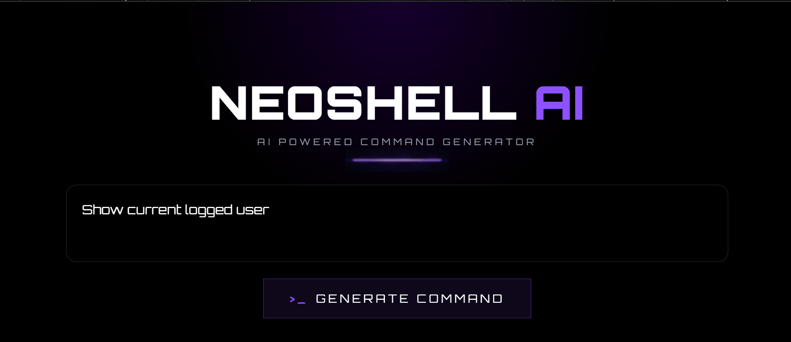
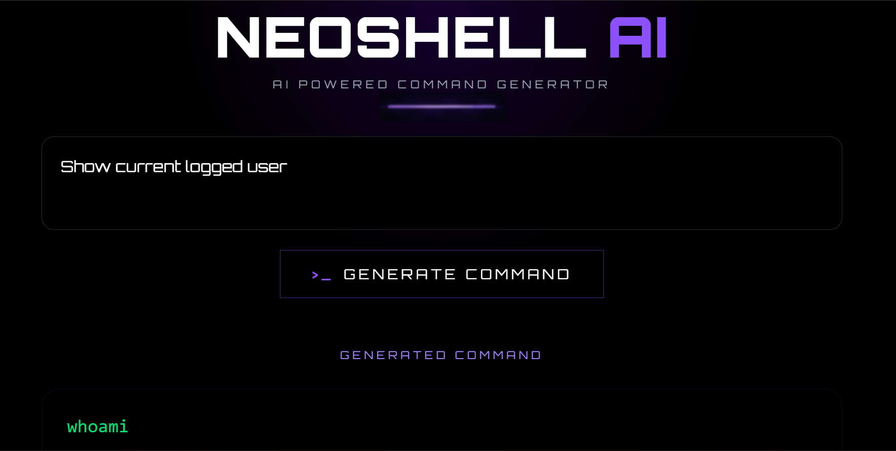
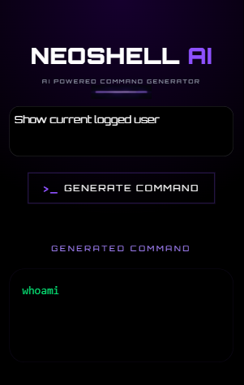

# NeoShell AI Frontend

Modern AI-powered command generation interface built with React, Tailwind CSS, and Vite.

NeoShell AI provides a futuristic terminal-inspired UI that allows users to generate operating system commands using natural language prompts.

---

## Tech Stack

### Frontend
- React
- Vite
- Tailwind CSS
- JavaScript

### Backend Integration
- FastAPI
- Groq API

---

## Preview

NeoShell AI features:

- Cyberpunk-inspired UI
- Responsive design
- Smooth auto-scroll interactions
- AI command generation
- FastAPI backend integration
- Groq LLM integration

---


## Features

- Generate shell commands using natural language
- Smooth scrolling to generated output
- Fully responsive design
- Neon cyberpunk-inspired interface
- Real-time backend API integration
- Clean modern UI/UX

---

## Project Structure

```bash
src/
│
├── assets/
│   └── images/
│       ├── glow-line.png
│       ├── landing-page.png
│       ├── mobile-view.png
│       ├── input.png
│       └── output.png
│
├── App.jsx
├── main.jsx
└── index.css

```

## Installation

Clone the repository:

```bash
git clone https://github.com/tichita7/neoshell-ai-frontend.git
```

Move into the project directory:

```bash
cd neoshell-ai-frontend
```

Install dependencies:

```bash
npm install
```

Run the development server:

```bash
npm run dev
```

---

## Backend Connection

The frontend communicates with the FastAPI backend running on:

```txt
http://127.0.0.1:8001
```

Make sure the backend server is running before generating commands.

---

## Example Prompt

### Input

```txt
Show current logged in user
```

### Generated Output

```powershell
whoami
```

---

## Screenshots

### Landing Page



---

### Input Prompt



---

### Generated Output



---

### Mobile Responsive View



---

## Responsive Design

NeoShell AI is optimized for:

- Desktop
- Tablet
- Mobile devices

Using Tailwind responsive breakpoints:

```txt
sm:
md:
lg:
xl:
```

---

## Author

Tichita Dhiman

---

## License

This project is licensed under the MIT License.